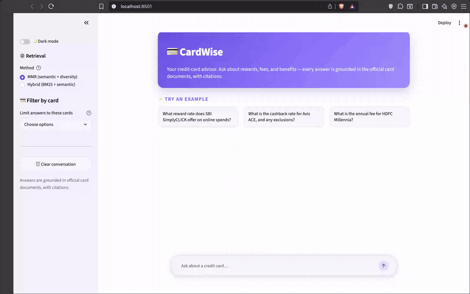
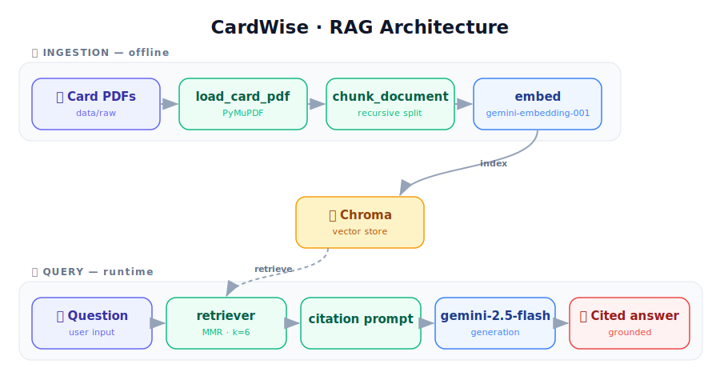

# 💳 CardWise

> A retrieval-augmented generation (RAG) assistant that answers questions about credit cards
> **grounded in the official card documents** — with mandatory source citations and a
> "don't answer if the docs don't say so" guardrail against hallucination.

<p align="center">
  
  
  
  
  
  
  <a href="LICENSE"></a>
</p>

Ask things like *"What is the cashback rate for Axis ACE, and any exclusions?"* and get an
answer drawn only from the ingested PDFs, with the card name cited.

---

## Contents

- [Demo](#demo)
- [How it works](#how-it-works)
- [Tech stack](#tech-stack)
- [Project structure](#project-structure)
- [Cards currently ingested](#cards-currently-ingested)
- [Setup](#setup)
- [Usage](#usage)
- [Evaluation](#evaluation)
- [Guardrails](#guardrails)
- [Design decisions](#design-decisions)
- [Tests](#tests)

---

## Demo

<p align="center">
  
</p>

## How it works

<p align="center">
  
</p>

1. **Ingest** — extract text from card PDFs, split into overlapping chunks, embed with
   `gemini-embedding-001`, and store in a persistent **Chroma** collection with per-card metadata.
2. **Query** — retrieve the most relevant chunks (**MMR** for diversity), feed them to
   `gemini-2.5-flash` through a strict, citation-enforcing prompt, and stream the answer.
3. **Evaluate** — score the pipeline with **RAGAS** (faithfulness, relevancy, context
   precision/recall) using Gemini as the judge. See [Evaluation](#evaluation).

> The chat app also offers an **experimental hybrid retriever** (BM25 + semantic, with stratified
> per-card retrieval) for exact-value and cross-card comparison queries — switch between **MMR**
> (default) and **Hybrid** live from the sidebar.

## Tech stack

- **LangChain** (core, text-splitters, community, experimental) — pipeline orchestration
- **Google Gemini** — `gemini-embedding-001` (embeddings) + `gemini-2.5-flash` (generation & eval judge)
- **Chroma** — local persistent vector store
- **PyMuPDF** — PDF text extraction
- **RAGAS** — RAG quality evaluation
- **rank-bm25** — keyword scoring for the experimental hybrid retriever
- **Streamlit** — interactive demo frontend

## Project structure

```
cardwise-ai/
├── app.py                       # Streamlit chat UI (demo frontend)
├── data/raw/                    # source card PDFs
├── src/
│   ├── ingestion/
│   │   ├── loader.py            # PDF → text + quality_check
│   │   └── chunker.py           # chunk_document() + benchmark_chunking()
│   ├── vectorstore/
│   │   └── embedder.py          # build_vectorstore() / load_vectorstore()
│   ├── rag/
│   │   ├── chain.py             # build_card_rag_chain()  (MMR retrieval)
│   │   └── prompts.py           # citation-enforcing advisor prompt
│   ├── retrieval/
│   │   └── retriever.py         # experimental hybrid BM25 + semantic retriever
│   ├── evaluation/
│   │   ├── eval.py              # RAGAS baseline eval (Gemini judge)
│   │   └── numeric_validator.py # numeric-claim extraction (stub — Week 3)
│   └── scripts/
│       ├── ingest_all.py        # build the vector store from all cards
│       ├── run_queries.py       # run sample queries from the CLI
│       └── run_hybrid.py        # try the experimental hybrid/stratified retrieval
└── requirements.txt
```

## Cards currently ingested

| Card | Issuer | Type | Annual fee |
|---|---|---|---|
| SBI SimplyCLICK | SBI Card | online-shopping | ₹499 |
| Axis ACE | Axis Bank | cashback | ₹499 |
| HDFC Millennia | HDFC Bank | cashback | ₹1000 |

## Setup

```bash
# 1. Create a virtual environment and install dependencies
python3 -m venv .venv
.venv/bin/pip install -r requirements.txt

# 2. Add your Gemini API key (never commit this file)
echo "GOOGLE_API_KEY=your_key_here" > .env
```

`.env` is gitignored — the key is read from the environment at runtime and is never hardcoded
or sent to the browser.

## Usage

```bash
# Build the vector store (run once, or after changing the card set)
PYTHONPATH=. .venv/bin/python -m src.scripts.ingest_all

# Launch the interactive frontend  →  http://localhost:8501
PYTHONPATH=. .venv/bin/streamlit run app.py

# Run sample queries from the terminal
PYTHONPATH=. .venv/bin/python -m src.scripts.run_queries

# Try the experimental hybrid + stratified retrieval
PYTHONPATH=. .venv/bin/python -m src.scripts.run_hybrid
```

## Evaluation

The RAG pipeline is scored with **RAGAS** using `gemini-2.5-flash` as the judge and
`gemini-embedding-001` for the embedding-based metric. Each question is scored across four
metrics, all ranging **0 → 1** (higher is better):

| Metric | What it measures | Inputs used |
|---|---|---|
| **Faithfulness** | Is every claim in the answer supported by the retrieved context? (anti-hallucination) | answer + contexts |
| **Answer relevancy** | Does the answer actually address the question asked? | question + answer |
| **Context precision** | Of the chunks retrieved, how many are actually relevant? (retrieval signal-to-noise) | question + contexts + reference |
| **Context recall** | Did retrieval surface all the context needed to cover the reference answer? | question + contexts + reference |

```bash
# Run the baseline eval (scores all questions; pass a smaller limit for a quick run)
PYTHONPATH=. .venv/bin/python -m src.evaluation.eval           # MMR (default)
PYTHONPATH=. .venv/bin/python -m src.evaluation.eval hybrid    # BM25 + semantic hybrid
```

### Baseline scores

Scores by retrieval method (all 5 questions):

| Metric | MMR | Hybrid |
|---|---|---|
| Faithfulness | 0.903 | 0.897 |
| Answer relevancy | 0.940 | 0.958 |
| Context recall | 1.000 | 1.000 |
| Context precision | 0.618 | 0.783 |

**Overall:** both methods perform comparably — full context recall and strong, well-grounded answers — with hybrid edging out MMR (keyword matching locks onto the exact terms asked).

---

## Guardrails

Because the domain is financial — a wrong fee or APR is a liability, not just a UX bug — hallucination
is defended in depth at three points in the pipeline, not patched in one place:

1. **Input gate — `quality_check()` in [loader.py](src/ingestion/loader.py).**
   Before anything is embedded, each PDF must prove it carries a *concrete* earning rate
   (a number + unit matched by regex — `5%`, `10X Reward`, `₹500`), not merely the word
   "cashback" in a disclaimer. In **strict mode the gate fails closed**: a card that doesn't
   pass raises and aborts the run instead of being silently embedded (garbage in → garbage out).
   It runs standalone with **zero embedding/API cost**:

   ```bash
   PYTHONPATH=. .venv/bin/python -m src.scripts.ingest_all --check-only
   ```

2. **Generation constraint — citation-enforcing prompt in [prompts.py](src/rag/prompts.py).**
   The model is instructed to answer *only* from retrieved context, cite the card it drew from,
   and decline ("the documents don't say") rather than guess when the context is silent.

3. **Output check — `extract_numeric_claims()` in [numeric_validator.py](src/evaluation/numeric_validator.py).**
   Pulls every numeric claim (rates, fees, multipliers) out of a generated answer so each can be
   cross-checked against the source documents. Extraction is the current half; the cross-check
   against context is the planned next step.

> The regex layers are deliberately simple and linear, and input is length-capped before matching,
> to avoid catastrophic backtracking (ReDoS) on untrusted PDF/LLM text.

---

## Design decisions

A few choices that were made deliberately, with the failure mode they avoid:

- **Hybrid BM25 + semantic retrieval, not pure-semantic.** Pure embedding search ranks
  "$395" and "$350" as near-equivalent because they cluster by *meaning*, silently returning
  wrong dollar amounts on exact-value queries. Adding keyword scoring fixes that — and the
  improvement is measured ([Evaluation](#evaluation): context precision 0.618 → 0.783), not assumed.
- **Card-stratified retrieval for comparisons.** A naive retriever favours whichever card has the
  longest or most-chunked PDF, biasing every "which card is better for X?" answer toward one option.
  `stratified_retrieve()` pulls top chunks *per card* so all cards get represented.
- **One embedding model as a single source of truth.** `EMBEDDING_MODEL` is defined once in
  [embedder.py](src/vectorstore/embedder.py) — the store is built and queried with the *same*
  model, because mismatched embeddings make vector distances meaningless with no error to warn you.
- **Indian-card corpus (SBI / Axis / HDFC), not US cards.** The official US card PDFs omit
  reward-earning rates; the Indian reward-T&C PDFs actually contain them — so the quality gate
  has something concrete to verify and the assistant can answer rate questions at all.

---

## Tests

Fast, **API-free** unit tests guard the logic that doesn't need a model — so they run in CI with
no key or quota. They pin the behaviour most likely to regress silently: the quality gate's
fail-closed contract, numeric-claim extraction, and the hybrid retriever's exact-match ranking.

```bash
# Install dev dependencies (runtime + pytest) and run the suite
.venv/bin/pip install -r requirements-dev.txt
PYTHONPATH=. .venv/bin/pytest -q
```

CI runs this suite on every push and pull request to `main` (see the **CI** badge above).

